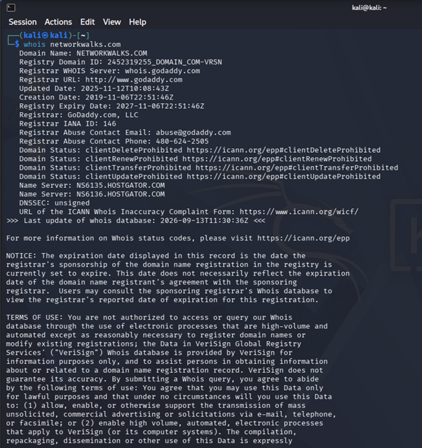
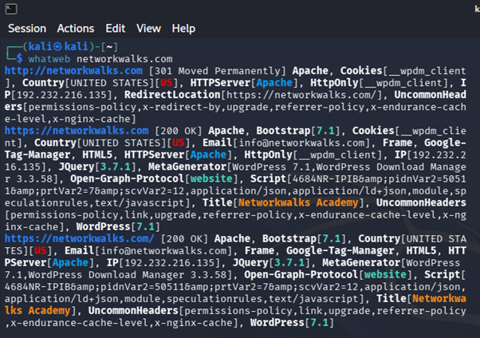
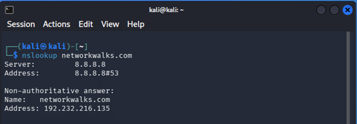
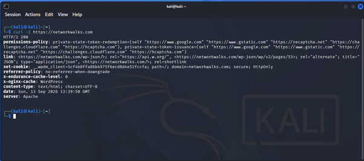
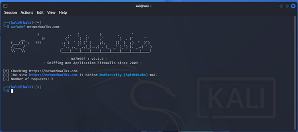
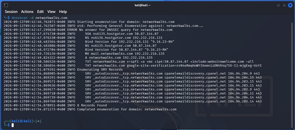
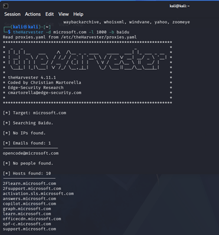
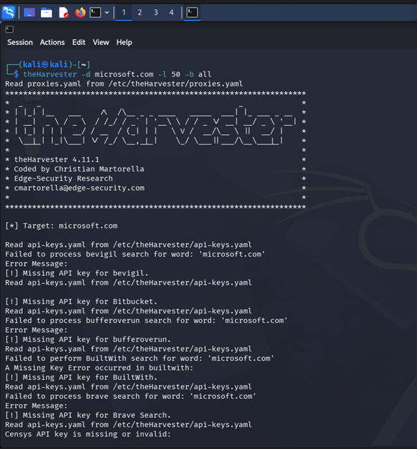
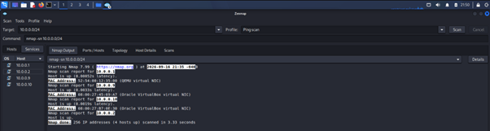
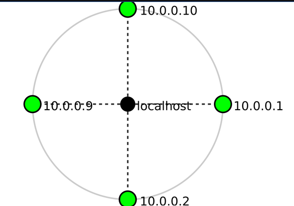

# NETWORKWALKS-B083-Week2
# Week 2 Penetration Testing & Reconnaissance Report

## Overview

This repository documents the active and passive reconnaissance activities conducted for the **Week 2 Penetration Testing** assessment against target web properties (`networkwalks.com` and `microsoft.com`). The primary objective is mapping organizational digital footprints, identifying hosting and infrastructure setups, and analyzing potential security risks.

---

## Technical Methodology & Evidence

### 1. WHOIS & Domain Ownership Lookup
Used to identify registrants, nameservers, registrar data, and expiration timelines.

---

### 2. Technology Stack Fingerprinting (WhatWeb)
Executed to identify underlying web servers, content management systems (CMS), embedded plugins, and programming frameworks.

---

### 3. DNS Resolution & Endpoint Testing (nslookup & curl)
Performed to extract IPv4/IPv6 mappings and inspect HTTP response headers for disclosure or security policy configurations.

#### DNS Queries

#### HTTP Response Banner Inspection

---

### 4. WAF Detection & DNS Enumeration (wafw00f & dnsrecon)
Identifies Web Application Firewalls protecting targets and discovers secondary DNS records, mail exchangers (MX), and zone transfers.

#### Web Application Firewall Scan

#### DNS Record Mapping

---

### 5. OSINT & Information Gathering (theHarvester)
Aggregates public information including subdomains, exposed employee email addresses, and server hostnames.

#### Subdomain Harvesting

#### Exposed Identity Discovery

---

### 6. Network & Port Scanning (Zenmap / Nmap)
Executes active network mapping to discover listening services, open network ports, and running service banners.

#### Host Discovery & Port Scanning

#### Service Version Detection

---

## Key Findings & Risk Matrix

### Medium Severity
* **Administrative & Staging Endpoint Exposure:** Subdomains exposed during enumeration increase the attack surface for potential targeting.
* **Verbose Service Version Banner Disclosure:** Detailed version data allows attackers to search for known CVE exploits.

### Low Severity / Informational
* **Public Information Leakage:** Public DNS and WHOIS records reveal infrastructure configuration.
* **Missing HTTP Security Headers:** Key protective HTTP headers (such as `HSTS`, `X-Content-Type-Options`) were missing or unconfigured.

---

## Remediation Recommendations

1. **Information Disclosure Suppression:** Disable verbose server banners and hide exact software version tags on public services.
2. **Endpoint Hardening:** Restrict access to staging environments and administrative portals using strict IP whitelisting or VPNs.
3. **HTTP Header Implementation:** Enforce security response headers (`HSTS`, `Content-Security-Policy`, `X-Frame-Options`) across all web servers.

---

## Document Deliverable

* 📄 **[Download Full Penetration Testing Report (PDF)](W2-PM-Final%20Report-Christ.pdf)** — Official comprehensive assessment report containing executive summaries, detailed methodology, and formal vulnerability analysis.
